## Exercise 2: Create functions in the portal

**Duration**: 45 minutes

In this exercise, you will create two new Azure Functions written in Node.js, using the Azure portal. These will be triggered by Event Grid and output to Azure Cosmos DB to save the results of license plate processing done by the ProcessImage function.

### Help references

|                  |          |
| ---------------- | -------- |
| **Description**  | **Link** |
| Create your first function in the Azure portal | <https://docs.microsoft.com/en-us/azure/azure-functions/functions-create-function-app-portal> |
| Store unstructured data using Azure Functions and Azure Cosmos DB | <https://docs.microsoft.com/azure/azure-functions/functions-integrate-store-unstructured-data-cosmosdb> |

### Task 1: Create a function to save license plate data to Azure Cosmos DB

In this task, you will create a new Node.js function triggered by Event Grid that outputs successfully processed license plate data to Azure Cosmos DB.

1. From Azure portal, Open the **hands-on-lab-<inject key="DeploymentID" enableCopy="false" />** resource group and select the Azure Function App whose name begins with **TollBoothEvents**.

   

1. Scroll down to **Functions** , then select **Create Function**.

    

1. On the **Create function** form, under **Select a template** tab:

   - Search for  **event grid** (1)
   - Select the **Azure Event Grid trigger** template (2).
   - Select the **Next** button (3).

    

1. On the **Create function** form, under **Template details** tab Enter `SavePlateData` (1) into the **Function name** field, then Click on **Create** (2)

    

1. On the **SavePlateData** Function blade, select **Code + Test** and replace the code in the new `SavePlateData` function's `index.js` file with the following:

    ```javascript
    module.exports = function(context, eventGridEvent) {
        context.log(typeof eventGridEvent);
        context.log(eventGridEvent);

        context.bindings.outputDocument = {
            fileName: eventGridEvent.data['fileName'],
            licensePlateText: eventGridEvent.data['licensePlateText'],
            timeStamp: eventGridEvent.data['timeStamp'],
            exported: false
        };

        context.done();
    };
    ```

1. Select **Save**.

### Task 2: Add an Event Grid subscription to the SavePlateData function

In this task, you will add an Event Grid subscription to the SavePlateData function. This will ensure that the events sent to the Event Grid topic containing the savePlateData event type are routed to this function.

1. With the SavePlateData function open, navigate to **Integration** (1) tab, then click on **Event Grid Trigger (eventGridEvent)** (2).

    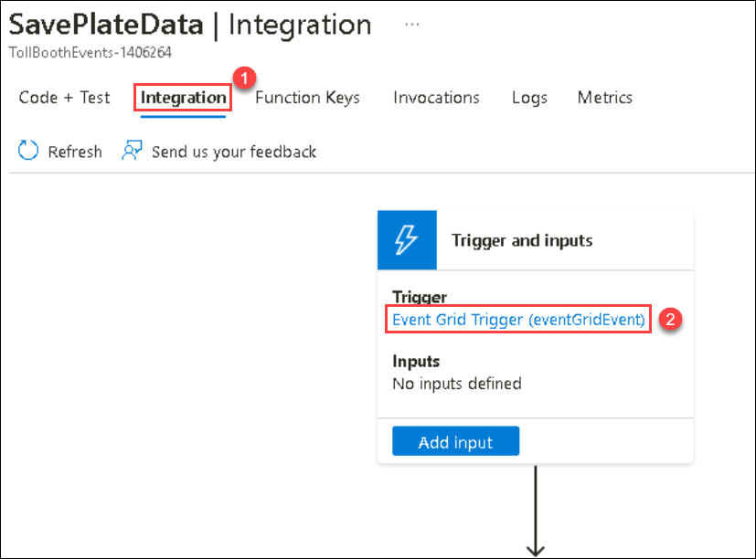

1. On the Edit Trigger form, select **Create Event Grid subscription**.

    

1. On the **Create Event Subscription** blade, specify the following configuration options and click on **Create** **(7)**

    - **Name**: Enter a unique value, similar to **saveplatedatasub<inject key="DeploymentID" enableCopy="false" />** **(1)** (ensure the green checkmark appears).
    - **Event Schema**: Select **Event Grid Schema** **(2)**.
    - **Topic Type**: Select **Event Grid Topics** **(3)**.
    - **Subscription**: Select the subscription you are using for this hands-on lab.
    - **Resource Group**: Select the **hands-on-lab-saveplatedatasub<inject key="DeploymentID" enableCopy="false" />** resource group from the list of existing resource groups.
    - **Resource**: Select your Event Grid Topic. This should be the only service listed and will start with **eventgridtopic-<inject key="DeploymentID" enableCopy="false" />** **(4)**.
    - **Event Types**: Select **Add Event Type** and enter **savePlateData** **(5)** for the new event type value. This will ensure this Event Grid type only triggers this function.
    - **Endpoint Type**: Leave **Azure Function** **(6)** as the Endpoint Type.
    - **Endpoint**: Leave as **SavePlateData** **(6)**.

    

### Task 3: Add an Azure Cosmos DB output to the SavePlateData function

In this task, you will add an Azure Cosmos DB output binding to the SavePlateData function, enabling it to save its data to the Processed collection.

1. While still on the **SavePlateData** Integration blade, select **+ Add output** under `Outputs`.

1. In the **Create Output** blade:

   - Select the `Azure Cosmos DB` for **Binding Type** (1).
   - Beneath the Cosmos DB account connection drop down, select the **New** link (2).
   - Choose the connection whose name begins with `cosmosdb-` (3).  
   - Select **OK** (4).

    

1. Specify the following additional configuration options in the Create Output form:

    - **Document parameter name**: Leave set to `outputDocument` **(1)**.
    - **Database name**: Enter `LicensePlates` **(2)**.
    - **Collection name**: Enter `Processed` **(3)**.
    - Click on **Add** **(4)**.

    

1. Close the `SavePlateData` function.

### Task 4: Create a function to save manual verification info to Azure Cosmos DB

In this task, you will create another new function triggered by Event Grid and outputs information about photos that need to be manually verified to Azure Cosmos DB.  

1. From Azure portal, Open the **hands-on-lab-SUFFIX** resource group and select the Azure Function App whose name begins with **TollBoothEvents**.

   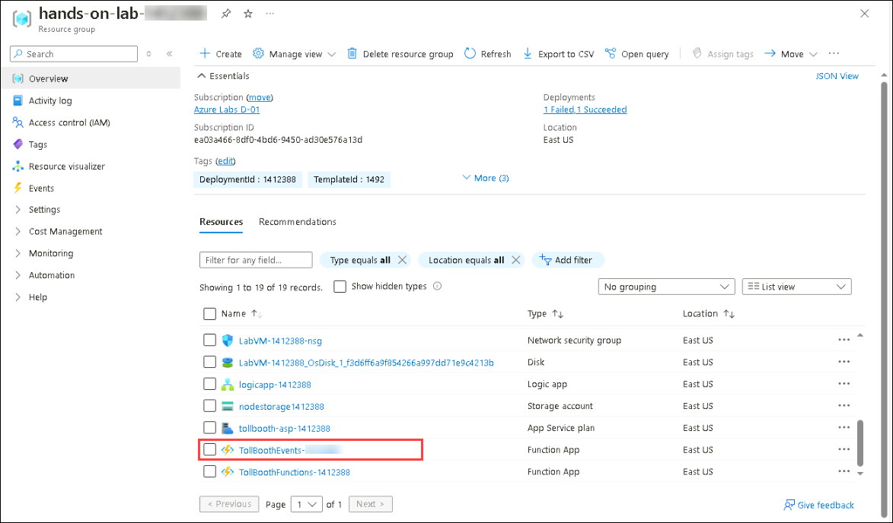


1. Scroll down to **Functions** tab, then select **+ Create**.

    

1. On the **Create function** form, under **Select a template** tab:

   - Search for **event grid** (1).
   - Select the **Azure Event Grid trigger** template (2).
   - Select **next** (3).

    

1. On the **Create function** form, under **Template details** tab Enter `QueuePlateForManualCheckup` (1) into the **Function name** field, then Click on **Create** (2)

    

1. On the **QueuePlateForManualCheckup** Function blade, select **Code + Test** from the left-hand menu and replace the code in the new `QueuePlateForManualCheckup` function's `index.js` file with the following:

    ```javascript
    module.exports = async function(context, eventGridEvent) {
        context.log(typeof eventGridEvent);
        context.log(eventGridEvent);

        context.bindings.outputDocument = {
            fileName: eventGridEvent.data['fileName'],
            licensePlateText: '',
            timeStamp: eventGridEvent.data['timeStamp'],
            resolved: false
        };

        context.done();
    };
    ```

1. Select **Save**.

### Task 5: Add an Event Grid subscription to the QueuePlateForManualCheckup function

In this task, you will add an Event Grid subscription to the QueuePlateForManualCheckup function. This will ensure that the events sent to the Event Grid topic containing the queuePlateForManualCheckup event type are routed to this function.

1. With the **QueuePlateForManualCheckup** function open, Navigate to **Integration** (1) tab. Select **Event Grid Trigger (eventGridEvent)** (2). 

    

1. On the Edit Trigger form, select **Create Event Grid subscription**.

   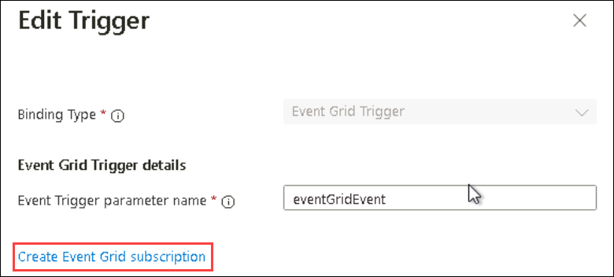

1. On the **Create Event Subscription** blade, specify the following configuration options and Select **Create** **(7)**.

    - **Name**: Enter a unique value, similar to **queueplateformanualcheckupsub-<inject key="DeploymentID" enableCopy="false" />** **(1)** (ensure the green check mark appears).
    - **Event Schema**: Select **Event Grid Schema** **(2)**.
    - **Topic Type**: Select **Event Grid Topics** **(3)**.
    - **Subscription**: Select the subscription you are using for this hands-on lab.
    - **Resource Group**: Select the **hands-on-lab-<inject key="DeploymentID" enableCopy="false" />** resource group from the list of existing resource groups.
    - **Resource**: Select your Event Grid Topic. This should be the only service listed and will start with **eventgridtopic-<inject key="DeploymentID" enableCopy="false" />** **(4)**.
    - **Event Types**: Select **Add Event Type** and enter **queuePlateForManualCheckup** **(5)** for the new event type value. This will ensure this function is only triggered by this Event Grid type.
    - **Endpoint Type**: Leave **Azure Function** **(6)** as the Endpoint Type.
    - **Endpoint**: Leave as **QueuePlateForManualCheckup** **(6)**.

    

1. close the Edit Trigger blade.

### Task 6: Add an Azure Cosmos DB output to the QueuePlateForManualCheckup function

In this task, you will add an Azure Cosmos DB output binding to the QueuePlateForManualCheckup function, enabling it to save its data to the NeedsManualReview collection.

1. While still on the **QueuePlateForManualCheckup** Integration blade, select **+ Add output** under **Outputs**.

1. In the **Create Output** form, select the following configuration options in the Create Output form:

    - **Binding Type**: Select `Azure Cosmos DB`.
    - **Cosmos DB account connection**: Select the **Azure Cosmos DB account connection** you created earlier.
    - **Document parameter name**: Leave set to `outputDocument`.
    - **Database name**: Enter `LicensePlates`.
    - **Collection name**: Enter `NeedsManualReview`.

1. Select **Add**.

    

1. Close the **QueuePlateForManualCheckup** function.

## Task 7: Create a Service Bus queue and topic 

In this task, you will create a Service Bus queue and topic to manage processed data messages and to support event-driven communication within your architecture.

1. Open the **hands-on-lab-<inject key="DeploymentID" enableCopy="false" />** resource group and select the Azure Service Bus  **ServiceBus-<inject key="DeploymentID" enableCopy="false" />**.

1. On the ServiceBus page click on **+ Queue**.

   

1. On the **Create Queue** form, update the configuration with these values, then Click on **create**(3).

   - **Name**: `Processed` (1)
   - **Max delivery count**: **1500** (2)

   

1. Wait till the completion **Queue creation**. 

1. Once the Queue creation is completed, navigate to **hands-on-lab-<inject key="DeploymentID" enableCopy="false" />** and open the **TollBoothIntegration-<inject key="DeploymentID" enableCopy="false" />** function app.

   

### Task 8: Configure the Integration Function

In this task, you'll add functions in TollBoothIntegration-<inject key="DeploymentID" enableCopy="false" /> function to integrate it with service bus.

**Create a function to save license plate data to Azure Cosmos DB**

1. From Azure portal, Open the **hands-on-lab-<inject key="DeploymentID" enableCopy="false" />** resource group and select the Azure Function App whose name begins with **TollBoothIntegration-<inject key="DeploymentID" enableCopy="false" />**.

   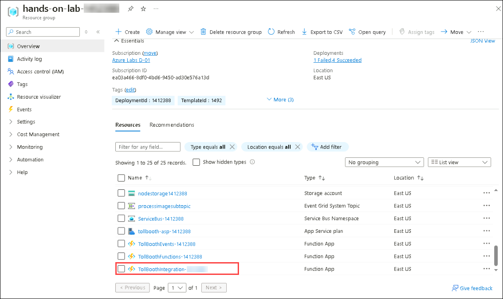

1. Scroll down to **Functions** , then select **Create Function**.

    

1. On the **Create function** form, under **Select a template** tab:

   - Search for  **event grid** (1)
   - Select the **Azure Event Grid trigger** template (2).
   - Select the **Next** button (3).

    

1. On the **Create function** form, under **Template details** tab Enter `SavePlateData` (1) into the **Function name** field, then Click on **Create** (2)

    

1. On the **SavePlateData** Function blade, select **Code + Test** and replace the code in the new `SavePlateData` function's `index.js` file with the following:

    ```javascript
    const { ServiceBusClient } = require('@azure/service-bus');
    const { CosmosClient } = require('@azure/cosmos');

    module.exports = async function (context, eventGridEvent) {
        context.log(typeof eventGridEvent);
        context.log(eventGridEvent);

        // Create the output document for Cosmos DB
        const outputDocument = {
            id: eventGridEvent.id,
            fileName: eventGridEvent.data['fileName'],
            licensePlateText: eventGridEvent.data['licensePlateText'],
            timeStamp: eventGridEvent.data['timeStamp'],
            exported: false
        };

        // Connect to Cosmos DB and add the document to the specified container
        const cosmosConnectionString = process.env['cosmosdb-<DEPLOYMENT-ID>_DOCUMENTDB'];
        const databaseName = 'LicensePlates';
        const containerName = 'Processed';
        const cosmosClient = new CosmosClient(cosmosConnectionString);
        const container = cosmosClient.database(databaseName).container(containerName);

        try {
            await container.items.create(outputDocument);
            context.log('Document successfully created in Cosmos DB');
        } catch (error) {
            context.log.error(`Error creating document in Cosmos DB: ${error.message}`);
            throw error;
        }

        // Create a message for the Service Bus queue
        const message = {
            body: outputDocument
        };

        // Connect to Service Bus and send the message
        const serviceBusConnectionString = process.env['ServiceBusConnection'];
        const queueName = 'Processed';
        const sbClient = new ServiceBusClient(serviceBusConnectionString);
        const sender = sbClient.createSender(queueName);

        try {
            await sender.sendMessages(message);
            context.log('Message sent to Service Bus queue');
        } catch (error) {
            context.log.error(`Error sending message to Service Bus queue: ${error.message}`);
            throw error;
        } finally {
            await sender.close();
            await sbClient.close();
        }

        context.done();
    };
    ```
1. In line 18, replace `<DEPLOYMENT-ID>` with **<inject key="DeploymentID" enableCopy="false" />** **(1)** and click on **Save** **(2)**

   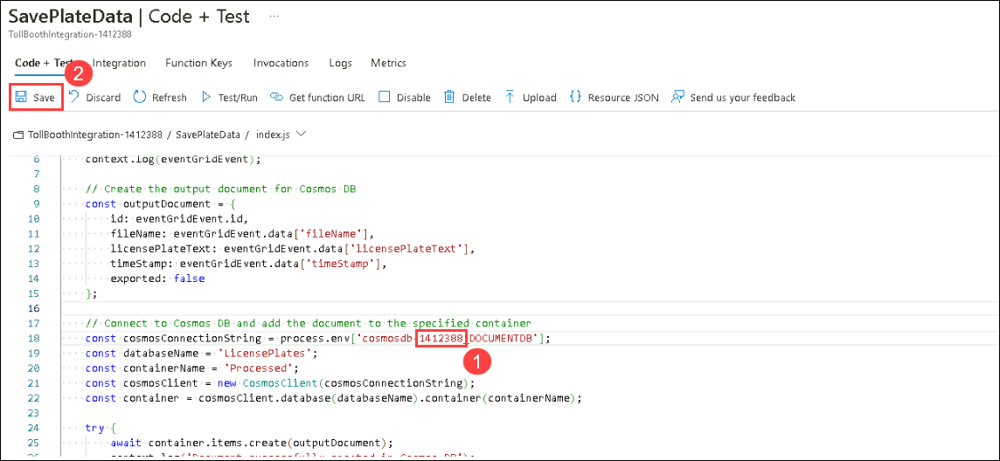

In this task, you will add an Event Grid subscription to the SavePlateData function. This will ensure that the events sent to the Event Grid topic containing the savePlateData event type are routed to this function.

1. With the SavePlateData function open, navigate to **Integration** (1) tab, then click on **Event Grid Trigger (eventGridEvent)** (2).

   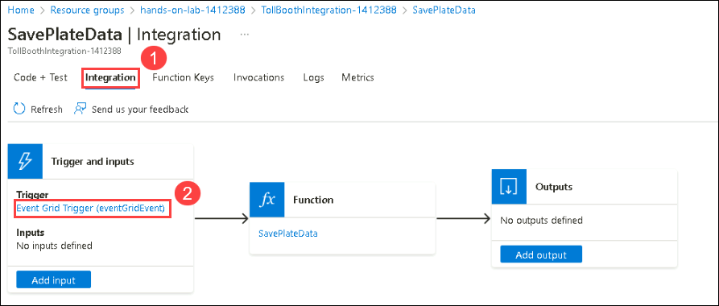

1. On the Edit Trigger form, select **Create Event Grid subscription**.

   

1. On the **Create Event Subscription** blade, specify the following configuration options and click on **Create** **(7)**

   - **Name**: Enter a unique value, similar to **saveplatedataIsub-<inject key="DeploymentID" enableCopy="false" />** **(1)** (ensure the green checkmark appears).
   - **Event Schema**: Select **Event Grid Schema** **(2)**.
   - **Topic Type**: Select **Event Grid Topics** **(3)**.
   - **Subscription**: Select the subscription you are using for this hands-on lab.
   - **Resource Group**: Select the **hands-on-lab-saveplatedatasub<inject key="DeploymentID" enableCopy="false" />** resource group from the list of existing resource groups.
   - **Resource**: Select your Event Grid Topic. This should be the only service listed and will start with **eventgridtopic-<inject key="DeploymentID" enableCopy="false" />** **(4)**.
   - **Event Types**: Select **Add Event Type** and enter **savePlateData** **(5)** for the new event type value. This will ensure this Event Grid type only triggers this function.
   - **Endpoint Type**: Leave **Azure Function** **(6)** as the Endpoint Type.
   - **Endpoint**: Leave as **SavePlateData** **(6)**.

   


1. While still on the **SavePlateData** Integration blade, select **+ Add output** under `Outputs`.

1. In the **Create Output** blade:

   - Select the `Azure Cosmos DB` for **Binding Type** (1).
   - Beneath the Cosmos DB account connection drop down, select the **New** link (2).
   - Choose the connection whose name begins with `cosmosdb-` (3).  
   - Select **OK** (4).

    

1. Specify the following additional configuration options in the Create Output form:

    - **Document parameter name**: Leave set to `outputDocument` **(1)**.
    - **Database name**: Enter `LicensePlates` **(2)**.
    - **Collection name**: Enter `Processed` **(3)**.
    - Click on **Add** **(4)**.

    

1. Close the `SavePlateData` function.

1. Navigate to home page  of **TollBoothIntegration-<inject key="DeploymentID" enableCopy="false" />** function. Scroll down to **Functions** tab, then select **+ Create**.

    

1. On the **Create function** form, under **Select a template** tab:

   - Search for **event grid** (1).
   - Select the **Azure Event Grid trigger** template (2).
   - Select **next** (3).

    

1. On the **Create function** form, under **Template details** tab Enter `QueuePlateForManualCheckup` (1) into the **Function name** field, then Click on **Create** (2)

    

1. On the **QueuePlateForManualCheckup** Function blade, select **Code + Test** from the left-hand menu and replace the code in the new `QueuePlateForManualCheckup` function's `index.js` **(1)** file with the following code and Select **Save (2)**.

    ```javascript
    module.exports = async function(context, eventGridEvent) {
        context.log(typeof eventGridEvent);
        context.log(eventGridEvent);

        context.bindings.outputDocument = {
            fileName: eventGridEvent.data['fileName'],
            licensePlateText: '',
            timeStamp: eventGridEvent.data['timeStamp'],
            resolved: false
        };

        context.done();
    };
    ```

1. With the **QueuePlateForManualCheckup** function open, Navigate to **Integration** (1) tab. Select **Event Grid Trigger (eventGridEvent)** (2). 

    

1. On the Edit Trigger form, select **Create Event Grid subscription**.

   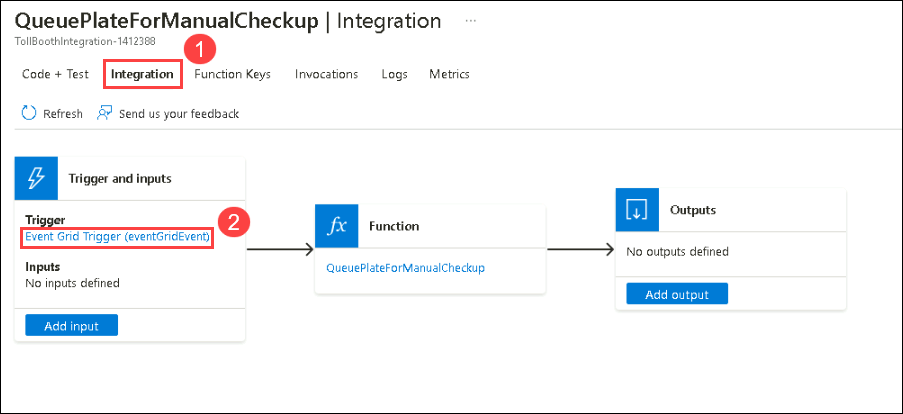

1. On the **Create Event Subscription** blade, specify the following configuration options and Select **Create** **(7)**.

    - **Name**: Enter a unique value, similar to **queueplateformanualcheckupIsub-<inject key="DeploymentID" enableCopy="false" />** **(1)** (ensure the green check mark appears).
    - **Event Schema**: Select **Event Grid Schema** **(2)**.
    - **Topic Type**: Select **Event Grid Topics** **(3)**.
    - **Subscription**: Select the subscription you are using for this hands-on lab.
    - **Resource Group**: Select the **hands-on-lab-<inject key="DeploymentID" enableCopy="false" />** resource group from the list of existing resource groups.
    - **Resource**: Select your Event Grid Topic. This should be the only service listed and will start with **eventgridtopic-<inject key="DeploymentID" enableCopy="false" />** **(4)**.
    - **Event Types**: Select **Add Event Type** and enter **queuePlateForManualCheckup** **(5)** for the new event type value. This will ensure this function is only triggered by this Event Grid type.
    - **Endpoint Type**: Leave **Azure Function** **(6)** as the Endpoint Type.
    - **Endpoint**: Leave as **QueuePlateForManualCheckup** **(6)**.

    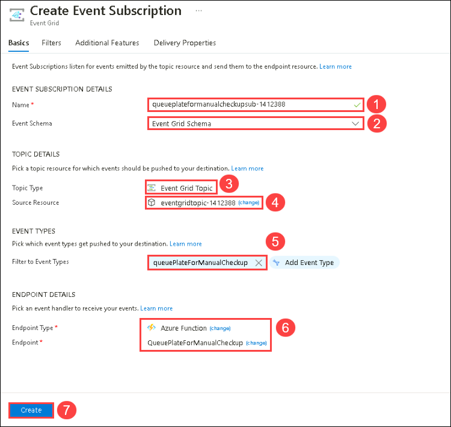

1. close the Edit Trigger blade.

1. While still on the **QueuePlateForManualCheckup** Integration blade, select **+ Add output** under **Outputs**.

1. In the **Create Output** form, select the following configuration options in the Create Output form:

    - **Binding Type**: Select `Azure Cosmos DB`.
    - **Cosmos DB account connection**: Select the **Azure Cosmos DB account connection** you created earlier.
    - **Document parameter name**: Leave set to `outputDocument`.
    - **Database name**: Enter `LicensePlates`.
    - **Collection name**: Enter `NeedsManualReview`.

1. Select **Add**.

    

1. Close the **QueuePlateForManualCheckup** function.

1. From **TollBoothIntegration-<inject key="DeploymentID" enableCopy="false" />** function, select **Developer Tools (1)** drop-down from the side blade and click on **Console (2)**.

   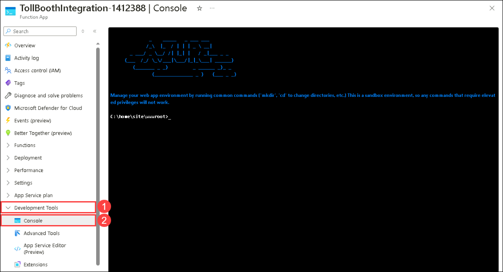

1. In the console, run the below given commands. Make sure to run the commands one by one and wait till the execution completes.

   ```javascript
   npm install @azure/service-bus
   ```

   ```javascript
   npm install @azure/cosmos
   ```

   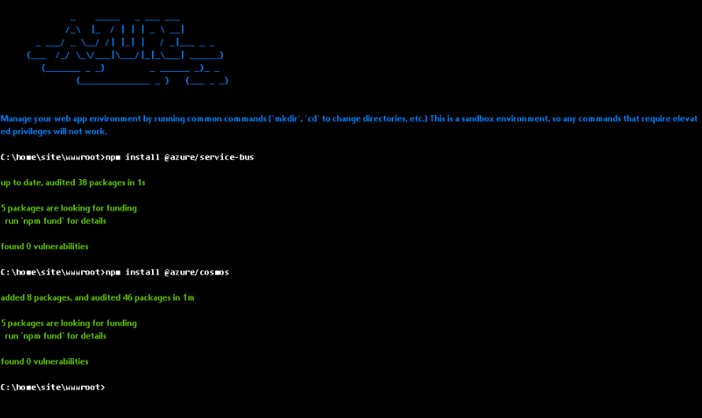


## Task 8: Add Service Bus output binding to SavePlateData function 

In this task, you'll bind the Service Bus to Azure Function App by adding connectio string which is used in Index.js file of SavePlateData function.

1. From Azure portal, Open the **hands-on-lab-<inject key="DeploymentID" enableCopy="false" />** resource group and select the Azure Function App whose name begins with **ServiceBus-<inject key="DeploymentID" enableCopy="false" />**.


1. Select **Shared Access Policies (1)** from settings, click on **RootManageSharedAccessKey (2)**, copy the **Primary Connection String (3)** and paste it in a notepad. 

   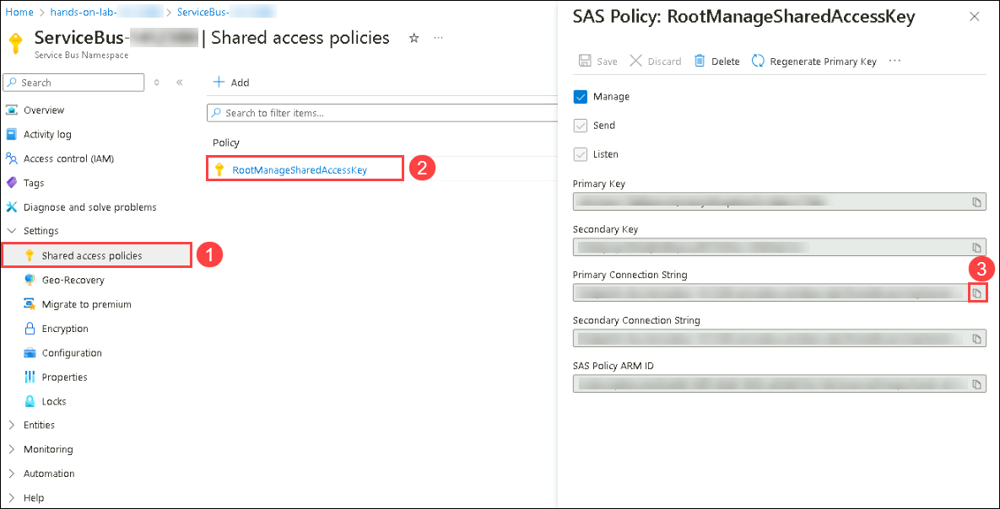

1. Navigate to home page  of **TollBoothIntegration-<inject key="DeploymentID" enableCopy="false" />** function. Select **Environment variables (1)** and click on **+Add (2)** buttion.

   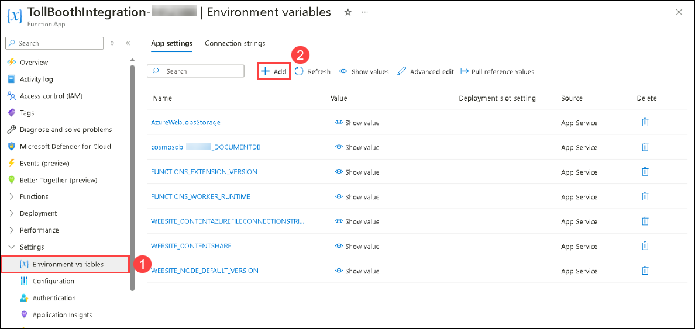

1. In the Add/Edit application setting tab, provide Name as **ServiceBusConnection** and paste the **Service Bus connection string (2)** which you copied in earlier step. Click on **Add (3)** button to save. 

   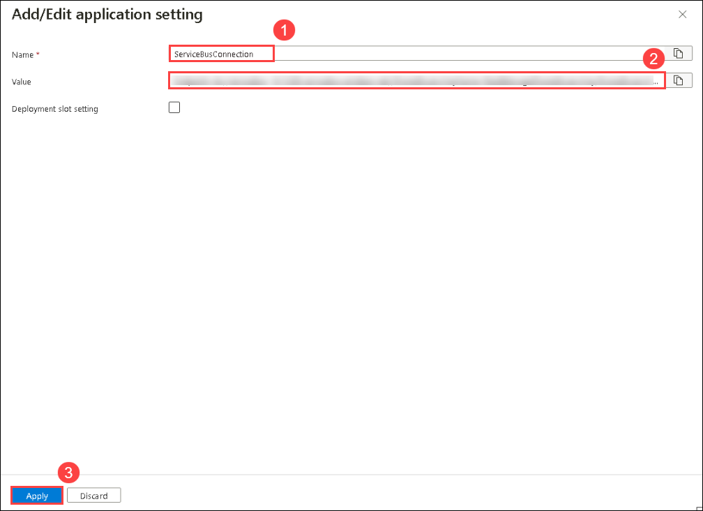

1. In App Settings tab, click on **Apply**.

   

## Task 9: Test the Serverless Architecture

In this task, you will debug the uploadImage solution and obaserve the working of serverless solution by just uploading the license plate images.

1. Navigate back  to the starter app solution in Visual Studio on the LabVM.

1. Navigate to the **UploadImages** project using the Solution Explorer of Visual Studio. Right-click on **UploadImages** project and select **Properties**.

    

1. Select **Debug** in the left-hand menu, then paste the connection string for your Azure Data Lake Storage Gen2 account into the **Application arguments** text field.

   > **Note**: To obtain the connection string:
   >
   > - In the Azure portal, navigate to the **datalake{SUFFIX}** storage account.
   > - Select **Access keys** from the left menu under **Security + Networking**.
   > - Copy the **Connection string** value of **key1**.
   

   Providing this value will ensure that the required connection string is added as an argument each time you run the application. Additionally, the combination of adding the value here and having the `.gitignore` file included in the project directory will prevent the sensitive connection string from being added to your source code repository in a later step.

    

1. Save your changes by selecting the Save icon on the Visual Studio toolbar.

1. Right-click the **UploadImages** project in the Solution Explorer, select **Debug**, then **Start New Instance** from the context menu.

    


1. When the console window appears, enter **1** and press **ENTER**. This action uploads a handful of car photos to the images container of your Blob storage account.

    

1. Switch back to your browser window, navigate to **hands-on-lab-<inject key="DeploymentID" enableCopy="false" />**  and open  **cosmosdb-<inject key="DeploymentID" enableCopy="false" />**.

   

1. Select **Data Explorer (1)** from the side blade, expand **LicensePlates (2)** database. You'll be able to see 2 containers **NeedsManualReview** and **Processed** **(3)**.

    

1. Click on **items** and you should be able to see that processed data and unprocessed are updated. This validates that your serverless architecture is working as expected.

    

## Summary

In this exercise, you added functions to TollBoothEvents-<inject key="DeploymentID" enableCopy="false" /> function. Also, you configured a service bus queue and integrated it with TollBoothIntegration-<inject key="DeploymentID" enableCopy="false" /> function.


