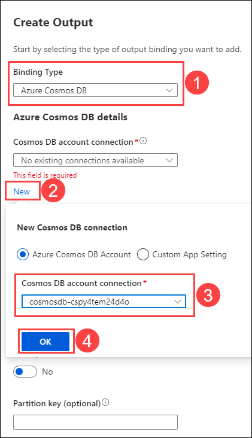
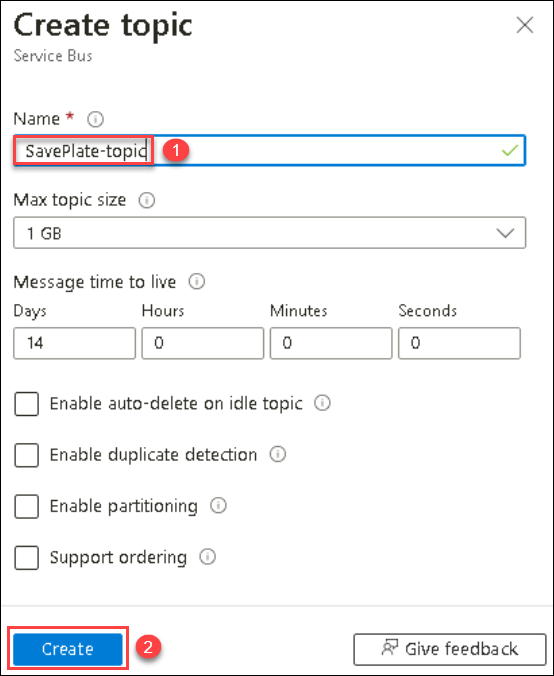

## Exercise 2: Create functions in the portal

**Duration**: 45 minutes

In this exercise, you will create two new Azure Functions written in Node.js, using the Azure portal. These will be triggered by Event Grid and output to Azure Cosmos DB to save the results of license plate processing done by the ProcessImage function.

### Help references

|                  |          |
| ---------------- | -------- |
| **Description**  | **Link** |
| Create your first function in the Azure portal | <https://docs.microsoft.com/en-us/azure/azure-functions/functions-create-function-app-portal> |
| Store unstructured data using Azure Functions and Azure Cosmos DB | <https://docs.microsoft.com/azure/azure-functions/functions-integrate-store-unstructured-data-cosmosdb> |

### Task 1: Create a function to save license plate data to Azure Cosmos DB

In this task, you will create a new Node.js function triggered by Event Grid that outputs successfully processed license plate data to Azure Cosmos DB.

1. Using a new tab or instance of your browser, navigate to the [Azure portal](https://portal.azure.com).

1. Open the **hands-on-lab-SUFFIX** resource group and select the Azure Function App whose name begins with **TollBoothEvents**.

1. Scroll down to **Functions** , then select **Create Function**.

    

1. On the **Create function** form, under **Select a template** tab:

   - Search for  **event grid** (1)
   - Select the **Azure Event Grid trigger** template (2).
   - Select the **Next** button (3).

    

1. On the **Create function** form, under **Template details** tab Enter `SavePlateData` (1) into the **Function name** field, then Click on **Create** (2)

    

1. On the **SavePlateData** Function blade, select **Code + Test** and replace the code in the new `SavePlateData` function's `index.js` file with the following:

    ```javascript
    module.exports = function(context, eventGridEvent) {
        context.log(typeof eventGridEvent);
        context.log(eventGridEvent);

        context.bindings.outputDocument = {
            fileName: eventGridEvent.data['fileName'],
            licensePlateText: eventGridEvent.data['licensePlateText'],
            timeStamp: eventGridEvent.data['timeStamp'],
            exported: false
        };

        context.done();
    };
    ```

1. Select **Save**.

### Task 2: Add an Event Grid subscription to the SavePlateData function

In this task, you will add an Event Grid subscription to the SavePlateData function. This will ensure that the events sent to the Event Grid topic containing the savePlateData event type are routed to this function.

1. With the SavePlateData function open, navigate to **Integration** (1) tab, then click on **Event Grid Trigger (eventGridEvent)** (2).

    

1. On the Edit Trigger form, select **Create Event Grid subscription**.

    

1. On the **Create Event Subscription** blade, specify the following configuration options:

    - **Name**: Enter a unique value, similar to **saveplatedatasub** (ensure the green checkmark appears).
    - **Event Schema**: Select **Event Grid Schema**.
    - **Topic Type**: Select **Event Grid Topics**.
    - **Subscription**: Select the subscription you are using for this hands-on lab.
    - **Resource Group**: Select the **hands-on-lab-SUFFIX** resource group from the list of existing resource groups.
    - **Resource**: Select your Event Grid Topic. This should be the only service listed and will start with `eventgridtopic-`.
    - **Event Types**: Select **Add Event Type** and enter `savePlateData` for the new event type value. This will ensure this Event Grid type only triggers this function.
    - **Endpoint Type**: Leave `Azure Function` as the Endpoint Type.
    - **Endpoint**: Leave as `SavePlateData`.

    

1. Select **Create** and then close the Edit Trigger dialog.

### Task 3: Add an Azure Cosmos DB output to the SavePlateData function

In this task, you will add an Azure Cosmos DB output binding to the SavePlateData function, enabling it to save its data to the Processed collection.

1. While still on the **SavePlateData** Integration blade, select **+ Add output** under `Outputs`.

1. In the **Create Output** blade:

   - Select the `Azure Cosmos DB` for **Binding Type** (1).
   - Beneath the Cosmos DB account connection drop down, select the **New** link (2).
   - Choose the connection whose name begins with `cosmosdb-` (3).  
   - Select **OK** (4).

    

1. Specify the following additional configuration options in the Create Output form:

    - **Document parameter name**: Leave set to `outputDocument`.
    - **Database name**: Enter `LicensePlates`.
    - **Collection name**: Enter `Processed`.

1. Select **OK**.

    

1. Close the `SavePlateData` function.

### Task 4: Create a function to save manual verification info to Azure Cosmos DB

In this task, you will create another new function triggered by Event Grid and outputs information about photos that need to be manually verified to Azure Cosmos DB.  This is in the Azure Function App that starts with **TollBoothEvents**.

1. Scroll down to **Functions** tab, then select **+ Create**.

    

1. On the **Create function** form, under **Select a template** tab:

   - Search for **event grid** (1).
   - Select the **Azure Event Grid trigger** template (2).
   - Select **next** (3).

    

1. On the **Create function** form, under **Template details** tab Enter `QueuePlateForManualCheckup` (1) into the **Function name** field, then Click on **Create** (2)

    

1. On the **QueuePlateForManualCheckup** Function blade, select **Code + Test** from the left-hand menu and replace the code in the new `QueuePlateForManualCheckup` function's `index.js` file with the following:

    ```javascript
    module.exports = async function(context, eventGridEvent) {
        context.log(typeof eventGridEvent);
        context.log(eventGridEvent);

        context.bindings.outputDocument = {
            fileName: eventGridEvent.data['fileName'],
            licensePlateText: '',
            timeStamp: eventGridEvent.data['timeStamp'],
            resolved: false
        };

        context.done();
    };
    ```

1. Select **Save**.

### Task 5: Add an Event Grid subscription to the QueuePlateForManualCheckup function

In this task, you will add an Event Grid subscription to the QueuePlateForManualCheckup function. This will ensure that the events sent to the Event Grid topic containing the queuePlateForManualCheckup event type are routed to this function.

1. With the **QueuePlateForManualCheckup** function open, Navigate to **Integration** (1) tab. Select **Event Grid Trigger (eventGridEvent)** (2). 

    

1. On the Edit Trigger form, select **Create Event Grid subscription**.

    

1. On the **Create Event Subscription** blade, specify the following configuration options:

    - **Name**: Enter a unique value, similar to `queueplateformanualcheckupsub` (ensure the green check mark appears).
    - **Event Schema**: Select **Event Grid Schema**.
    - **Topic Type**: Select **Event Grid Topics**.
    - **Subscription**: Select the subscription you are using for this hands-on lab.
    - **Resource Group**: Select the **hands-on-lab-SUFFIX** resource group from the list of existing resource groups.
    - **Resource**: Select your Event Grid Topic. This should be the only service listed and will start with `eventgridtopic-`.
    - **Event Types**: Select **Add Event Type** and enter `queuePlateForManualCheckup` for the new event type value. This will ensure this function is only triggered by this Event Grid type.
    - **Endpoint Type**: Leave `Azure Function` as the Endpoint Type.
    - **Endpoint**: Leave as `QueuePlateForManualCheckup`.

    

1. Select **Create** and close the Edit Trigger blade.

### Task 6: Add an Azure Cosmos DB output to the QueuePlateForManualCheckup function

In this task, you will add an Azure Cosmos DB output binding to the QueuePlateForManualCheckup function, enabling it to save its data to the NeedsManualReview collection.

1. While still on the **QueuePlateForManualCheckup** Integration blade, select **+ Add output** under **Outputs**.

1. In the **Create Output** form, select the following configuration options in the Create Output form:

    - **Binding Type**: Select `Azure Cosmos DB`.
    - **Cosmos DB account connection**: Select the **Azure Cosmos DB account connection** you created earlier.
    - **Document parameter name**: Leave set to `outputDocument`.
    - **Database name**: Enter `LicensePlates`.
    - **Collection name**: Enter `NeedsManualReview`.

1. Select **OK**.

    

1. Close the **QueuePlateForManualCheckup** function.

## Task 7: Create a Service Bus queue and topic 

In this task, you will create a Service Bus queue and topic to manage processed data messages and to support event-driven communication within your architecture.

1. Open the **hands-on-lab-SUFFIX** resource group and select the Azure Service Bus whose name begins with **ServiceBus**.

1. On the ServiceBus page click on **+ Queue**.

    

1. On the **Create Queue** form, update the configuration with these values, then Click on **create**(3).

    - **Name**: `SavePlate-Queue` (1)
    - **Max delivery count**: **1000** (2)

    

1. Wait till the completion Queue creation. Now On the ServiceBus page click on **+ Topic** 

    

1. On the **Create Topic** form, use the name `SavePlate-topic` (1) in the **Name** field, then Click on **create** (2).

    

1. Wait till the completion of **Topic Creation**.


## Task 8: Add Service Bus output binding to SavePlateData function 
pending...
