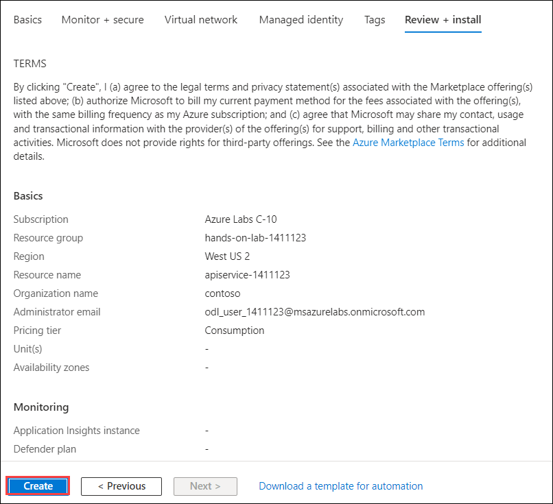
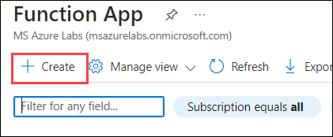
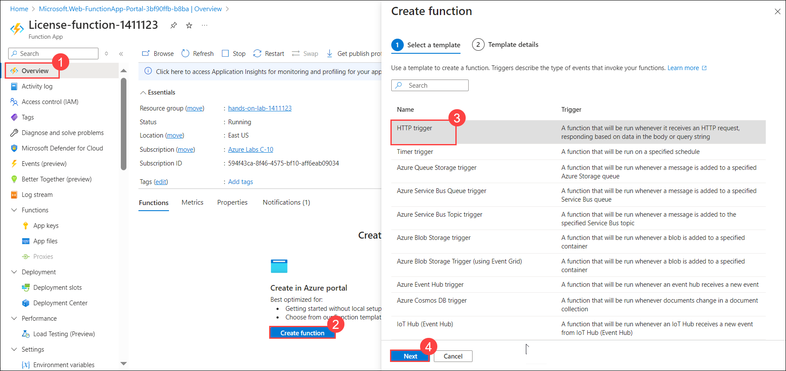
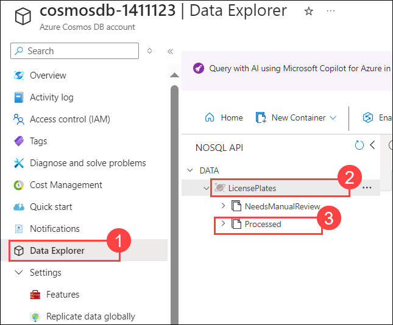
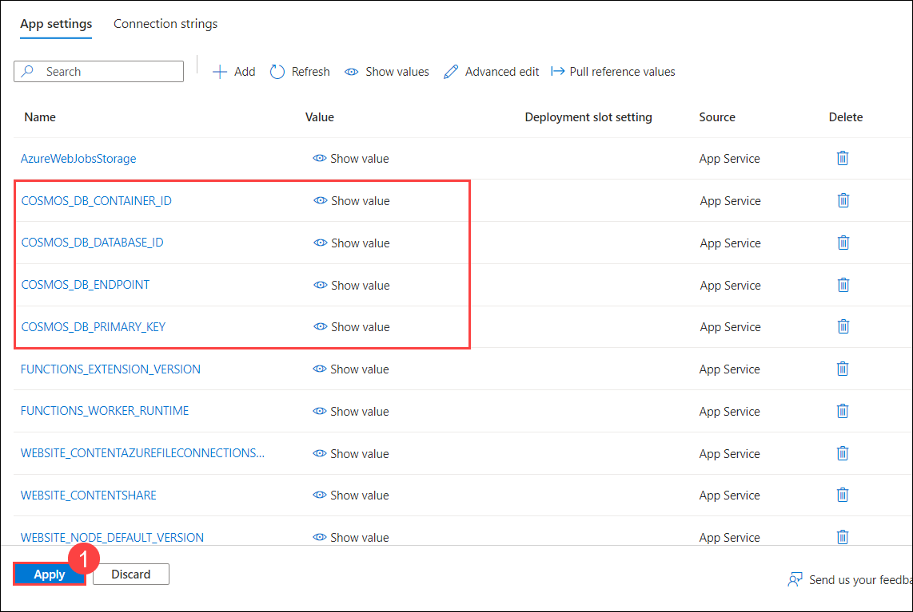
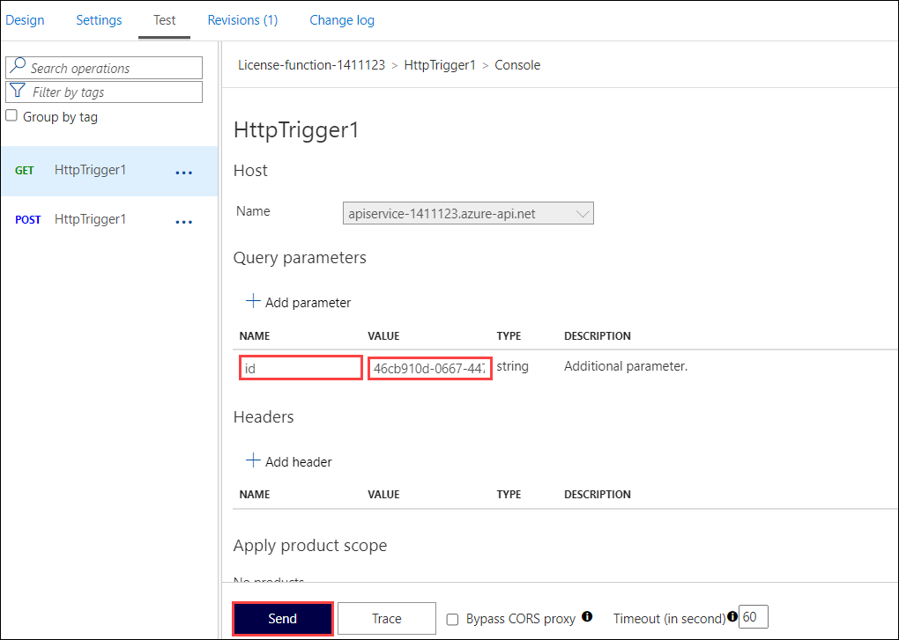
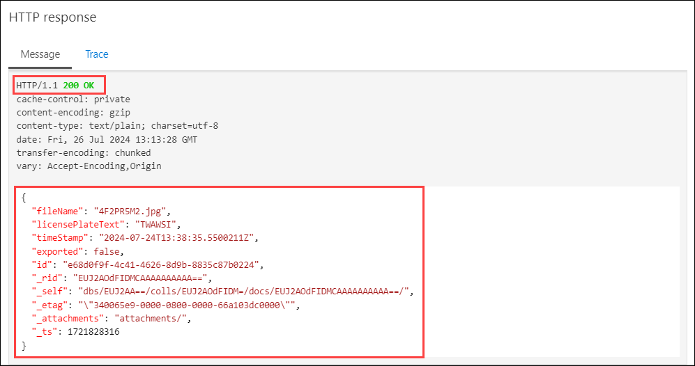

## Exercise:3 Integrate API Management with Your Azure Functions

### Task 1: Create an API Management instance 

In this task, you will create an API Management instance in Azure. API Management is a service that acts as a gateway between backend services and client applications, allowing for centralized management, security, and monitoring of APIs.


1. On the **Azure Portal**, in the **Search resources, services, and docs (G+/) box** at the top of the portal, enter **API Management services (1)**, and then select **API Management services (2)** under **Services**.

    

1. Click on **Create**.

    

1. In Basic tab of **Create API Mangement services** page fill the necessary details and click on **Review + create**.

   | Setting         | Value |
   ------------------|---------
   | **Subscription** | Keep it as default (1)|
   | **Resource group**| hands-on-lab-<inject key="DeploymentID"></inject> (2)|
   | **Resource name** | apiservice-<inject key="DeploymentID"></inject> (3)|
   | **Organization name** | contoso- (4)|
   | **Administrator email** | <inject key="AzureAdUserEmail"></inject> (5)|
   | **Pricing tier** | Consumption (6)|

    
    


1. Review your configuration and click on **Create**.

    

### Task 2: Create a function to pull driver's license information 

1. In the search bar of the Azure Portal search for **Function app (1)** in the search bar. Select **Function App (2)**.

    

1. Click on **+ Create**.

    

1. From the Create Function App tab, select **Consumption** and select **Next**.

    

1. On the **Basics** tab of Create Function App, provide details as mentioned in the table below and select **Review + create** (6) at the bottom of the page and subsequently click on **Create**.

    | Setting | Action |
    | -- | -- |
    | **Subscription** | Keep it as default |
    | **Resource Group** | hands-on-lab-<inject key="DeploymentID"></inject> (2) |
    | **Function App name** | **License-function-<inject key="DeploymentID"></inject>** (3) |
    | **Runtime stack** | **Node.js** (4) |
    | **Operating System** | **Windows** (5) |

    

     >**Note:** Keep rest of the options as default.
 
1. Once the deployment is completed, click on **Go to resource**.

1. On the **Overview (1)** page of the **Function app**, under the  **Function** tab, click on **Create function (2)**. It will open a  page for **Create function**. Search for and select **HTTP trigger (3)**. Click on **Next (4)**.

    

1. On Template details page, leave the default options and click on **Create**.

    

1. You will find a function got created with name.

    

1. In the search bar of the Azure Portal search for **Cosmos DB (1)** in the search bar. Select **Azure Cosmos DB (2)**.

    

1. Select your **cosmosdb-<inject key="DeploymentID"></inject>** account.

1. Click on the **Keys** (2) under **Settings** (1) and copy the **URI** (3) (Endpoint), click on the **eye** (4) icon and then copy your **PRIMARY KEY** (5). Note down your URI and PRIMARY KEY.

    

1. Click on the **Data Explorer** (1), note down databaseId which is **LicensePlates** (2) and containerId which is **Processed** (3).

    

1. Navigate back to your **HttpTrigger** function from the function app name **License-function-<inject key="DeploymentID"></inject>**.

1. On the **HttpTrigger1** Function blade, select Code + Test and replace the code in the new `HttpTrigger1` function's `index.js` file with the following:

    ```
    const { CosmosClient } = require("@azure/cosmos");

    const endpoint = process.env.COSMOS_DB_ENDPOINT;
    const key = process.env.COSMOS_DB_PRIMARY_KEY;
    const databaseId = process.env.COSMOS_DB_DATABASE_ID;
    const containerId = process.env.COSMOS_DB_CONTAINER_ID;

    const client = new CosmosClient({ endpoint, key });

    module.exports = async function (context, req) {
        context.log('JavaScript HTTP trigger function processed a request.');

        const id = req.query.id || (req.body && req.body.id);

        if (!id) {
            context.res = {
                status: 400,
                body: "Please pass a driver license id on the query string or in the request body"
            };
            return;
        }

        context.log('Querying item with ID:', id);

        try {
            const database = client.database(databaseId);
            const container = database.container(containerId);

            // Use the `query` method to search for items if `id` is not the partition key
            const { resources: items } = await container.items
                .query({ query: 'SELECT * FROM c WHERE c.id = @id', parameters: [{ name: '@id', value: id }] })
                .fetchAll();

            if (items.length > 0) {
                context.res = {
                    status: 200,
                    body: items[0]
                };
            } else {
                context.res = {
                    status: 404,
                    body: "Driver's license not found"
                };
            }
        } catch (err) {
            context.log.error("Error fetching data from Cosmos DB:", err);
            context.res = {
                status: 500,
                body: "Error fetching data from Cosmos DB"
            };
        }
    };

    ```

1. Go to the **Environment variables** (2), under the **settings (1)** and click on **+ ADD**.

    

1. Now add all values in **Environment variables** for:

    ```
    COSMOS_DB_ENDPOINT;
    COSMOS_DB_PRIMARY_KEY;
    COSMOS_DB_DATABASE_ID;
    COSMOS_DB_CONTAINER_ID;
    ```

1. Now add your **COSMOS_DB_ENDPOINT** (1) as **Name** and the **Value** (2) that you have copied previously then click on **Apply** (3).

    

    >**Note**: Make sure to add all the values in **Environment variables**.

1. After adding all the values click on the **Apply** and **Confirm** to Save changes.

    
    

### Task 3: Import your Function App into API Management

1. On the **Azure Portal**, in the **Search resources, services, and docs (G+/) box** at the top of the portal, enter **API Management services (1)**, and then select **API Management services (2)** under **Services**.

    

1. Select the api management service as **apiservice-<inject key="DeploymentID"></inject>**.

1. Click on **Console** (1) under the  **Development Tools** and run the command to install the Azure Cosmos DB.

    ```
    npm install @azure/cosmos
    ```

    

1. From the **APIs** (1), click on the **APIs** (2) and select the **Function APP** (3).

    

1. From the **Create from Function App** page, select the **Browse** option.

    

1. On the **Import Azure Functions** click on the **Select** button 

    

1. Click on the **License-function-<inject key="DeploymentID"></inject>** and click **Select** for Azure Function APP.

    

1. Click on the **Select** to add your **HttpTrigger1** function for GET and POST.

    

1. It will fetch all the details for the function app and click on **Create**.

    

1. Here we get the Function App get added and find **GET** and **POST** operation of **HttpTrigger1** functions are added.

    

### Task 4: Secure the API with API Management (e.g., API keys, OAuth 2.0) 

### Task 5: Configure API policies (e.g., rate limiting, logging) 

### Task 6: Test the API through the APIM Developer Portal

1. In the search bar of the Azure Portal search for **Cosmos DB (1)** in the search bar. Select **Azure Cosmos DB (2)**.

    

1. Select your **cosmosdb-<inject key="DeploymentID"></inject>** account.

1. Click on the **Data Explorer** (1), under the **LicensePlates** (2) expeand the **Processed** (3), select the **items** (4) and select an **id** (5) and copy the **id value**.

    

1. On the **Azure Portal**, in the **Search resources, services, and docs (G+/) box** at the top of the portal, enter **API Management services (1)**, and then select **API Management services (2)** under **Services**.

    

1. Select the api management service as **apiservice-<inject key="DeploymentID"></inject>**.

1. On the APIs the **License-function-<inject key="DeploymentID"></inject>** function got added, Now click on the **Test** (1).

    

1. On the **Test** page select the **GET HttpTrigger1** (1) and click on the **+ Add parameters** (2).

    

1. Provide the **Name** as **id** and thier corresponding **Value** that have been copied from the Items of Processed conatiner in Cosmos DB. Click on **Send**.

    

1. Once the GET Request is send it will fetch the all the details related to LicensePlate.

    

1. Now copy the **Request URL** and Open in new tab window.

    

1. It will give access denied due to missing subscription key. 

    

1. For this we need to remove the subscription key required from the settings, So click on the **Settings** and **Uncheked** the **Subscription required**, click to **Save**.

    

1. Now refresh the page and will find the details of the fetch data of **LicensePlate**.

    
