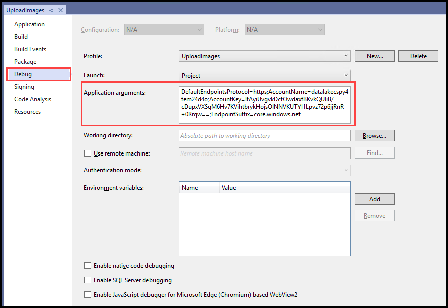
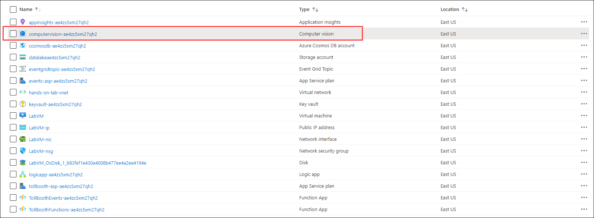

## Exercise 4: Monitor your functions with Application Insights

**Duration**: 15 minutes

Application Insights can be integrated with Azure Function Apps to provide robust monitoring for your functions. In this exercise, you examine telemetry in the Application Insights account that you created when provisioning the Function Apps. Since you associated the Application Insights account with the Function Apps when creating them, the Application Insights telemetry key was added to the Function App configuration for you.

### Help references

|                 |          |
| --------------- | -------- |
| **Description** | **Link** |
| Monitor Azure Functions using Application Insights | <https://docs.microsoft.com/azure/azure-functions/functions-monitoring> |
| Live Metrics Stream: Monitor & Diagnose with 1-second latency | <https://docs.microsoft.com/azure/application-insights/app-insights-live-stream> |

### Task 1: Use the Live Metrics Stream to monitor functions in real-time

1. Open the **appinsights** Application Insights resource from within your lab resource group.

    

1. In Application Insights, select **Live Metrics Stream** under **Investigate** in the left-hand navigation menu.

    
1. Leave the Live Metrics Stream open and return to the starter app solution in Visual Studio on the LabVM.

1. Navigate to the **UploadImages** project using the Solution Explorer of Visual Studio. Right-click on **UploadImages** project and select **Properties**.

    

1. Select **Debug** in the left-hand menu, then paste the connection string for your Azure Data Lake Storage Gen2 account into the **Application arguments** text field.

   > **Note**: To obtain the connection string:
   >
   > - In the Azure portal, navigate to the **datalake{SUFFIX}** storage account.
   > - Select **Access keys** from the left menu.
   > - Copy the **Connection string** value of **key1**.
   >  

   Providing this value will ensure that the required connection string is added as an argument each time you run the application. Additionally, the combination of adding the value here and having the `.gitignore` file included in the project directory will prevent the sensitive connection string from being added to your source code repository in a later step.

    

1. Save your changes by selecting the Save icon on the Visual Studio toolbar.

1. Right-click the **UploadImages** project in the Solution Explorer, select **Debug**, then **Start New Instance** from the context menu.

    

    >**Note:** Ensure the files are located under `C:\ServerlessMCW\`. If the files are located under a longer root path, such as `C:\Users\workshop\Downloads\`, then you will encounter build issues in later steps: `The specified path, file name, or both are too long. The fully qualified file name must be less than 260 characters, and the directory name must be less than 248 characters.`

1. When the console window appears, enter **1** and press **ENTER**. This action uploads a handful of car photos to the images container of your Blob storage account.

    

1. Switch back to your browser window with the Live Metrics Stream still open within Application Insights. You should start seeing new telemetry arrive, showing the number of servers online, the incoming request rate, CPU process amount, etc. You can select some of the sample telemetry in the list to the side to view output data.

    

1. Leave the Live Metrics Stream window open once again and close the console window for the image upload. Debug the UploadImages project again, then enter **2** and press **ENTER**. This will upload 1,000 new photos.

    

1. Switch back to the Live Metrics Stream window and observe the activity as the photos are uploaded. You can see the number of servers online, which translates to the number of Function App instances running between both Function Apps. You should also notice things such as a steady cadence for the Request Rate monitor, the Request Duration hovering below \~200ms second, and the Incoming Requests roughly matching the Outgoing Requests.

    

1. After this has run for a while, close the image upload console window once again, but leave the Live Metrics Stream window open.

### Task 2: Observe your functions dynamically scaling when resource-constrained

In this task, you will change the Computer Vision API to the Free tier. This will limit the number of requests to the OCR service to 10 per minute. Once changed, run the UploadImages console app to upload 1,000 images again. The resiliency policy is programmed into the FindLicensePlateText.MakeOCRRequest method of the ProcessImage function will begin exponentially backing off requests to the Computer Vision API, allowing it to recover and lift the rate limit. This intentional delay will significantly increase the function's response time, causing the Consumption plan's dynamic scaling to kick in, allocating several more servers. You will watch all of this happen in real-time using the Live Metrics Stream view.

1. Open your Computer Vision API service by opening the **hands-on-lab-SUFFIX** resource group and then selecting the resource that starts with **computervision-**.

    

1. Select **Pricing tier**(1) under **Resource Management** in the menu. Select the **F0 Free**(2) pricing tier, then select **Apply**(3).

    > **Note**: If you already have an **F0** free pricing tier instance, you will not be able to create another one.

    
1. Switch to Visual Studio, debug the **UploadImages** project again, then enter **2** and press **ENTER**. This will upload 1,000 new photos.

    

1. Switch back to the Live Metrics Stream window and observe the activity as the photos are uploaded. After running for a couple of minutes, you should start to notice a few things. The Request Duration will begin to increase over time. As this happens, you should notice more servers being brought online. Each time a server is brought online, you should see a message in the Sample Telemetry stating that it is "Generating 2 job function(s)", followed by a Starting Host message. You should also see messages logged by the resilience policy that the Computer Vision API server is throttling the requests. This is known by the response codes sent back from the service (429). A sample message is "Computer Vision API server is throttling our requests. Automatically delaying for 16000ms".

    > **Note**: If you select a sample telemetry item and cannot see its details, drag the resize bar at the bottom of the list up to resize the details pane.

    

1. After this has run for some time, close the UploadImages console to stop uploading photos.

1. Navigate back to the **Computer Vision** resource in the Azure portal and set the pricing tier back to **S1 Standard**.