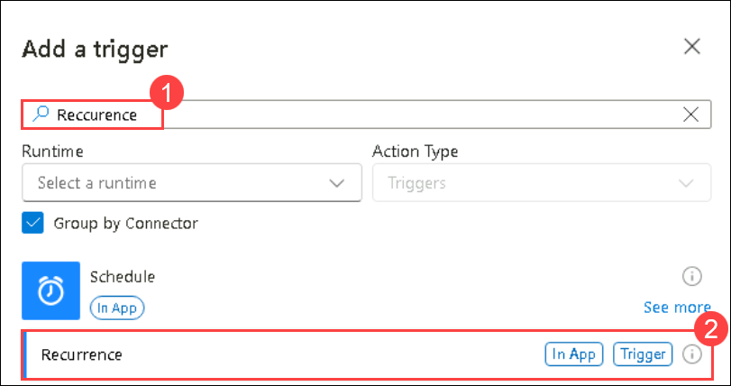
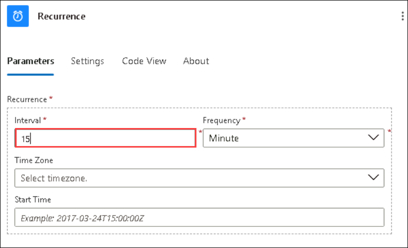
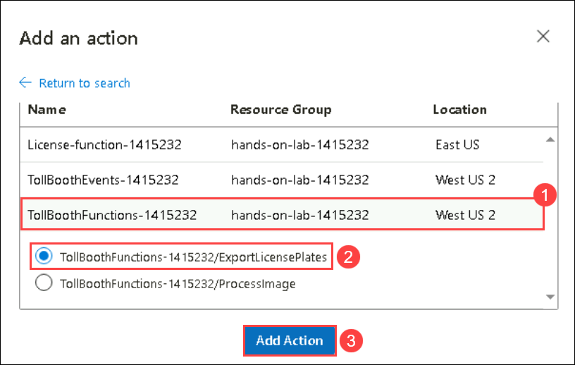
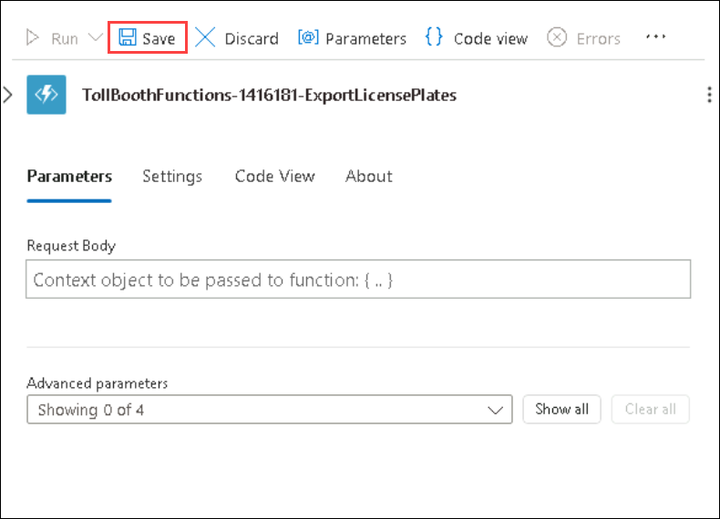
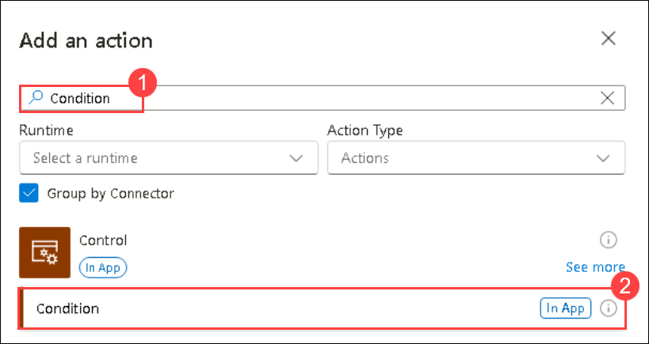
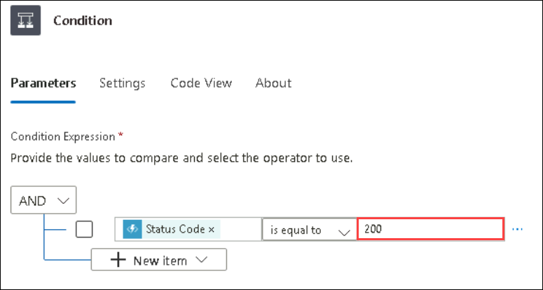

# Exercise 6: Create the data export workflow

**Duration**: 30 minutes

Here you will be using Azure Logic Apps which is a cloud-based service that enables you to automate workflows and integrate various services and applications. It provides a visual designer for building and managing workflows, making it easy to orchestrate complex processes without writing extensive code.

In this exercise, you'll develop a new Logic App to automate your data export workflow. This Logic App will be configured to execute on a scheduled basis, calling the ExportLicensePlates function to retrieve license plate data. The workflow includes a conditional logic step: if the function finds that there are no records to export, the Logic App will automatically send an email notification. This setup ensures that your team stays informed about the status of data exports, even when no new data is available, thereby streamlining communication and operational efficiency.

### Help references

|                 |           |
| --------------- |---------- |
| **Description** | **Links** |
| What is Azure Logic Apps? | <https://docs.microsoft.com/en-us/azure/logic-apps/logic-apps-overview> |
| Call Azure Functions from logic apps | <https://docs.microsoft.com/azure/logic-apps/logic-apps-azure-functions> |

## Task 1: Create the Logic App

In this task you will be creating a logic app which will export the data for every 15 minutes if not then send an email to customerservice.

1. In the [Azure portal](https://portal.azure.com), navigate to the **hands-on-lab-SUFFIX** resource group.

   > You can get to the resource group by selecting **Resource groups** under **Azure services** on the Azure portal home page and then select the resource group from the list. If there are many resource groups in your Azure account, you can filter the list for **hands-on-lab** to reduce the resource groups listed.

1. On your resource group blade, select the **logicapp** Logic App resource in the resource group's list of services available.

1. In the **Logic App Designer** **(1)**, click on **Add a trigger** **(2)**. 

    

1. In the **Add a trigger** page, Search for **Recurrence** **(1)** and select **Recurrence** **(2)**.

    

1. Enter **15** into the **Interval** box, and make sure Frequency is set to **Minute**. This can be set to an hour or some other interval, depending on business requirements. and click on **Save**.

    

1. Now in the **Logic App Designer** click on **+** marker and select **Add an action**.

    

1. In the **Add an action** form Enter `Functions` **(1)** in the filter box, then select the **Azure Functions** **(2)**.

    

1. Select your **TollBoothFunctions** **(1)** Function App and check the **ExportLicensePlates** **(2)** function as shown. Click on **Add action** **(3)**. 

    

1. On the **Add action** pane, keep everything as default and click on **save** and return to the **Logic App Designer**.

    

1. Select **+** marker and select **Add an action**.

    

1. search for `condition` **(1)**. Select the **Condition****(2)** Control option from the Actions search result.

    

1. On the **Condition** pane click on the symbol which represents the function app as shown.

    

1. Scroll down and choose the **Status code** option.

    

1. On the **Condition** page, make sure the condition is set to **is equal to** and set the value as **200** and save it.

    

    > **Note**: This evaluates the status code returned from the ExportLicensePlates function, which will return a 200 code when license plates are found and exported. Otherwise, it sends a 204 (NoContent) status code when no license plates were discovered that need to be exported. We will conditionally send an email if any response other than 200 is returned.

1. We will ignore the If true condition because we don't want to perform an action if the license plates are successfully exported. Select **Add an action** within the **If false** condition block.

    

1. Enter `Send an email (V2)` in the filter box, then select the **Send an email (V2)** action for Office 365 Outlook.

    

1. Select **Sign in** and sign in to your Office 365 Outlook account.

    

1. In the Send an email form, provide the following values:

     - Enter your email address in the **To** box.
     - Provide a **Subject**, such as `Toll Booth license plate export failed`.
     - Please enter a message into the **Body** and select the **Status code** from the ExportLicensePlates function to add it to the email body.

     

1. Select **Save** in the toolbar to save your Logic App.

1. Select **Run Trigger** and click on **Run** to execute the Logic App. You should start receiving email alerts because the license plate data is not being exported. This is because we need to finish making changes to the ExportLicensePlates function to extract the license plate data from Azure Cosmos DB, generate the CSV file, and upload it to Blob storage.

    

1. While in the Logic Apps Designer, you will see the run result of each step of your workflow. A green check mark is placed next to each step that successfully executed, showing the execution time to complete. This can be used to see how each step is working, and you can select the executed step and see the raw output.

    

1. The Logic App will continue to run in the background, executing every 15 minutes (or whichever interval you set) until you disable it. To disable the app, go to the **Overview** blade for the Logic App and select the **Disable** button on the taskbar.

    
