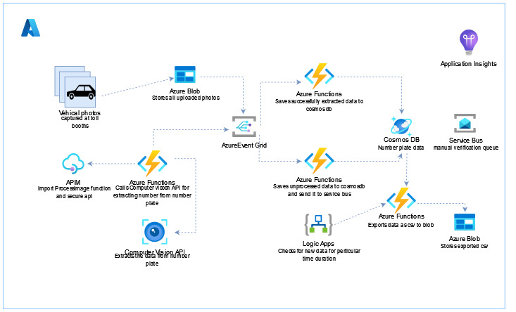

## Introduction to serverless architecture

# Serverless architecture hands-on lab step-by-step

## Abstract and learning objectives

In this hands-on lab, you implement an end-to-end solution using a supplied sample based on Microsoft Azure Functions, Azure Cosmos DB, Azure Event Grid, and related services. The scenario will include implementing compute, storage, workflows, and monitoring using various components of Microsoft Azure. You can implement the hands-on lab on your own. However, it is highly recommended to pair up with other members at the lab to model a real-world experience and to allow each member to share their expertise for the overall solution.

At the end of the hands-on lab, you will have confidence in designing, developing, and monitoring a serverless solution that is resilient, scalable, and cost-effective.

## Overview

Contoso is rapidly expanding its toll booth management business to operate in a much larger area. As this is not their primary business, which is online payment services, they struggle with scaling up to meet the upcoming demand to extract license plate information from many new tollbooths, using photos of vehicles uploaded to cloud storage. Currently, they have a manual process where they send batches of images to a 3rd-party who manually transcodes the license plates to CSV files that they send back to Contoso to upload to their online processing system.

They want to automate this process in a way that is cost-effective and scalable. They believe serverless is the best route for them but do not have the expertise to build the solution.

## Solution architecture

Below is a diagram of the solution architecture you will build in this lab. Please study this carefully to understand the whole of the solution as you are working on the various components.

   

Certainly. This architecture diagram illustrates a serverless solution for processing vehicle photos using various Azure services. Here's a breakdown of the workflow:

1. Data Input: Vehicle photos are captured and stored in Azure Blob Storage.

2. Event Triggering: Azure Event Grid detects new blob uploads and triggers Azure Functions.

3. Data Processing: 
   - One Azure Function extracts data from the photos and stores it in Cosmos DB.
   - Another Azure Function saves event data to Cosmos DB and sends a message to Service Bus.

4. Further Processing:
   - A third Azure Function is triggered by the Service Bus message, which processes the exported data and stores it in Azure Blob Storage.

5. Workflow Orchestration: Logic Apps create license plates for a particular time duration, likely based on the processed data.

6. API Management: An API Management (APM) instance is used to import OpenAPI definition and secure the API.

7. Computer Vision API: This is used for extracting license plate information from the photos.

8. Monitoring: Application Insights is integrated for monitoring and analytics of the entire system.

This architecture leverages serverless computing (Azure Functions) and event-driven design (Event Grid, Service Bus) to create a scalable, efficient system for processing vehicle photos, extracting license plate data, and managing the information flow through various Azure services.
